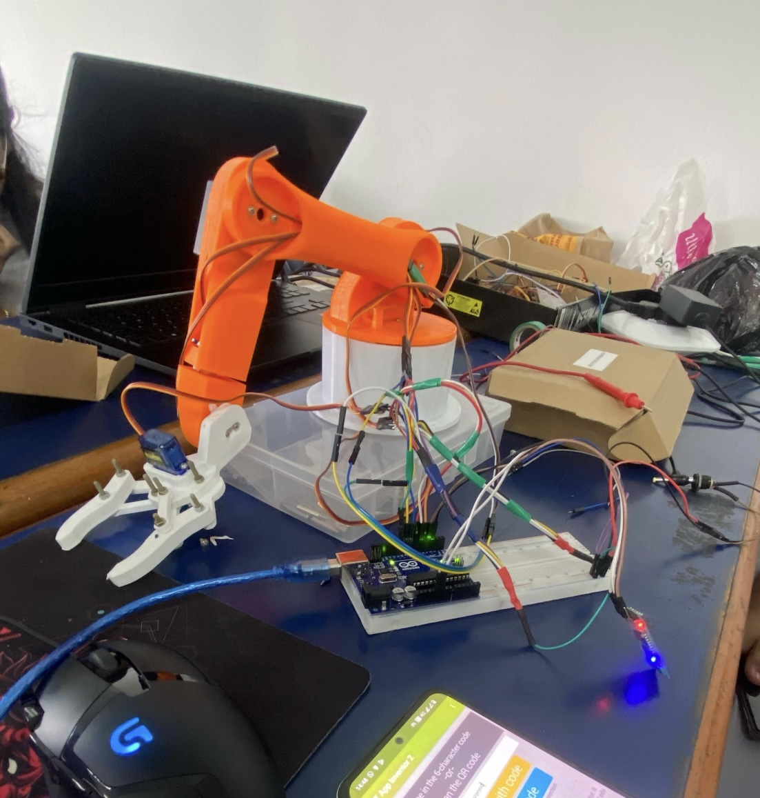

# 5-DOF Robotic Arm

A 5-degree-of-freedom Robotic Arm built with an ESP8266 microcontroller, controlled wirelessly via a web interface using the MQTT protocol.

## Features
- **5 Degrees of Freedom**: Controls for the Base, Shoulder, Elbow, Wrist, Pivot, and a Gripper.
- **Wireless Communication**: Uses the MQTT protocol (Mosquitto Broker) for reliable, real-time control.
- **Web Interface**: A responsive HTML dashboard (`src/web.html`) featuring six sliders to independently control each joint and the gripper in real-time.

## Hardware Components
- **Microcontroller**: NodeMCU ESP8266
- **Heavy Duty Servos (12V)**: 3x MG995 Servos (used for Elbow, Shoulder, Base)
- **Standard Servos (5V)**: 3x SG90 Servos (used for Gripper, Pivot, Wrist)

### Assembly Instructions
Please follow the servo pin configuration defined in `src/esp8266.ino` during the robotic arm assembly.

## Getting Started

### Software Interface
1. **ESP8266 Setup**: Open `src/esp8266.ino` in the Arduino IDE, configure your MQTT/WiFi settings if needed, and upload it to the ESP8266.
2. **Web Control**: Launch `src/web.html` in your browser (e.g., via VSCode Live Server) to control the robotic arm through the webpage sliders.
